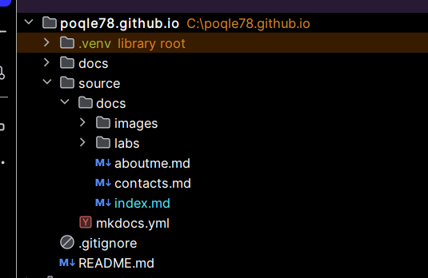

# Лабораторная работа 1
## Создание статического сайта

### Данный сайт и есть лабораторная работа №1 :)

Цель работы:  
1. Освоить процесс создания статического сайта с использованием генератора документации MkDocs.   
2. Научиться организовывать структуру документации проекта (портфолио лабораторных работ).  
3. Изучить базовые принципы работы с системой контроля версий Git и платформой GitHub.  
4. Развернуть статический сайт с использованием механизма GitHub Pages на домене вида username.github.io.  
5. Освоить базовую настройку темы оформления и конфигурационного файла mkdocs.yml.  

### Структура проекта

## Оформление сайта
 - Выбрана тема "material", так как она показалась самой привлекательной и подходящей для тематики портфолио.
К тому же, в ней есть возомжность менять тему (светлая и темная) и есть код с подсветкой и кнопкой «копировать». 
Вы уже можете наблюдать как выглядит данный сайт.   
## Вывод
- Освоена работа с генератором статических сайтов MkDocs.
 - Полученены навыки в организиции структуры проекта.
 - Получено понимае процесса публикации проекта в сети Интернет без использования серверной части.